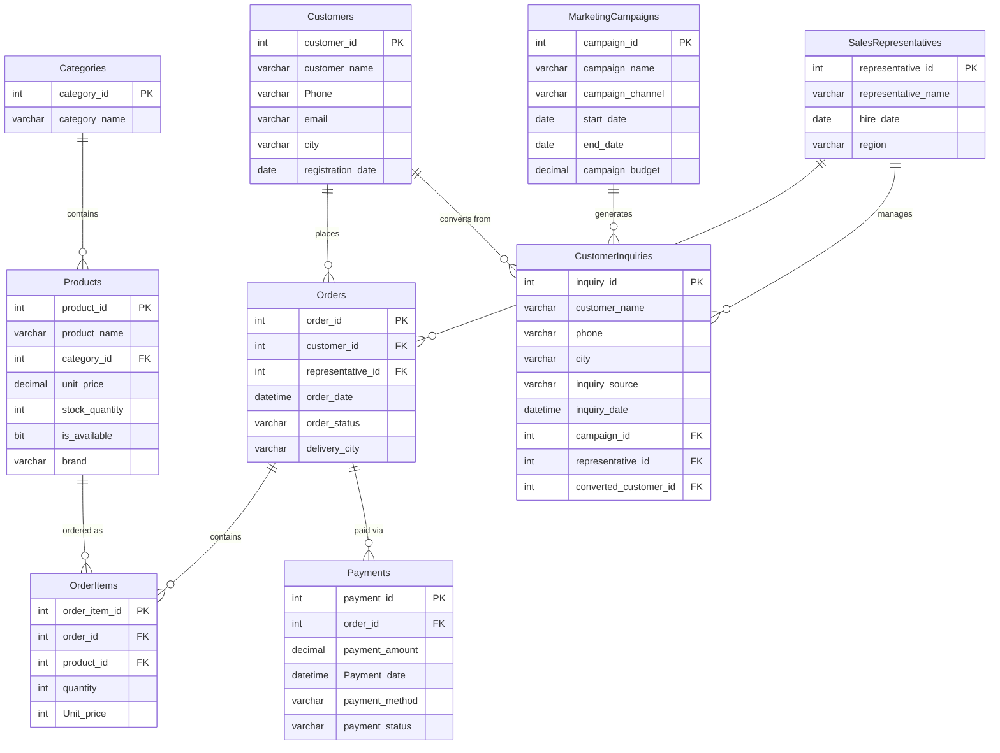

# 🖥️ TechStore Database Project

A complete **Microsoft SQL Server (T-SQL)** project simulating the backend database of an electronics retail business — *TechStore*. The project covers relational schema design, sample data seeding, and a progressive set of SQL exercises ranging from basic filtering to advanced analytics with CTEs, window functions, and reporting views.

---

## 📌 Project Overview

| | |
|---|---|
| **Domain** | Electronics retail (customers, products, orders, marketing & sales) |
| **Engine** | Microsoft SQL Server (T-SQL) |
| **Database** | `TechStoreDB` |
| **Files** | 2 `.sql` scripts (schema + queries) |
| **Focus areas** | DDL, DML, joins, aggregation, subqueries, CTEs, window functions, views, data cleaning, business KPIs |

The project is organized as two sequential assignments that build on the same database:

1. **`Create_TechStore_DB_Assignment1.sql`** — Database creation, sample data, and foundational querying (filtering, joins, aggregation, KPIs).
2. **`TechStore_SQL_Server_Assignment2.sql`** — Data cleaning, business classification, time-based analysis, subqueries, CTEs, views, and window functions.

---

## 🗂️ Database Schema

`TechStoreDB` consists of **9 tables** modeling customers, the product catalog, the sales funnel, and order fulfillment.



### Table reference

| Table | Purpose | Key Relationships |
|---|---|---|
| `Customers` | Registered customers | Referenced by `Orders`, `CustomerInquiries` |
| `Categories` | Product categories (Laptops, Smartphones, etc.) | Referenced by `Products` |
| `Products` | Product catalog with pricing & stock | → `Categories` |
| `SalesRepresentatives` | Sales team | Referenced by `Orders`, `CustomerInquiries` |
| `MarketingCampaigns` | Marketing campaigns by channel/budget | Referenced by `CustomerInquiries` |
| `CustomerInquiries` | Leads captured from campaigns | → `MarketingCampaigns`, `SalesRepresentatives`, `Customers` (on conversion) |
| `Orders` | Customer orders | → `Customers`, `SalesRepresentatives` |
| `OrderItems` | Line items per order | → `Orders`, `Products` |
| `Payments` | Payments against orders | → `Orders` |

---

## 🚀 Getting Started

### Prerequisites
- SQL Server **2016 or later** (required for the `TRIM` function used in data-cleaning queries)
- SQL Server Management Studio (SSMS) or Azure Data Studio

### Setup

Run the scripts **in order** — the second script assumes the database and data from the first already exist.

```sql
-- Step 1: create the database, schema, and seed data
:r Create_TechStore_DB_Assignment1.sql

-- Step 2: run the data cleaning / analytics queries
:r TechStore_SQL_Server_Assignment2.sql
```

Or simply open each file in SSMS and execute it top to bottom against your SQL Server instance.

---

## 📁 File Structure

```
├── Create_TechStore_DB_Assignment1.sql     # Schema, seed data, and foundational queries
├── TechStore_SQL_Server_Assignment2.sql    # Data cleaning & advanced analytics
└── README.md
```

---

## 📖 Assignment 1 — Database Creation & Foundational Queries

**`Create_TechStore_DB_Assignment1.sql`**

| Section | Description |
|---|---|
| **Schema Creation** | `CREATE DATABASE` / `CREATE TABLE` with primary & foreign keys across all 9 tables |
| **Data Seeding** | `INSERT` statements populating customers, products, campaigns, orders, order items, and payments; sample `UPDATE`/`DELETE` statements |
| **Customer Queries** | Filtering by city, missing phone, name search, newest registrations |
| **Product Queries** | Price range filters, stock checks, category filters, top N by price |
| **Order Queries** | Status filters, date-range filters, missing representative checks |
| **Inquiry Queries** | Filtering by source, conversion status, missing data |
| **Basic Aggregations** | `COUNT`, `SUM`, `AVG` across customers, products, orders, and payments |
| **GROUP BY Queries** | Counts and averages broken down by city, category, status, and payment method |
| **HAVING Queries** | Filtering aggregated groups (e.g. cities with 2+ customers) |
| **Business KPIs** | Inquiry conversion rate — overall, by campaign, and by source |
| **INNER JOIN Queries** | Combining products/categories, orders/customers, payments/customers, etc. |
| **Multi-Table Joins** | 3–4 table joins linking customers → orders → items → products |
| **FULL OUTER JOIN & Missing Records** | Customers with no orders, products never ordered, orders with no payment, etc. |
| **Joins with Aggregation** | Order counts per customer, revenue per category, orders per representative |
| **Consolidated Order Report** | Single query combining order, customer, item count, quantity, order value, and paid amount |
| **Business Interpretation** | Top-selling product/category, top city, top campaign, unpaid orders, conversion rate |

---

## 📈 Assignment 2 — Data Cleaning & Advanced Analytics

**`TechStore_SQL_Server_Assignment2.sql`**

| Task | Focus | Key Techniques |
|---|---|---|
| **Task 1** | Clean customer & inquiry data | `ISNULL`, `TRIM`, `UPPER`, `LOWER` |
| **Task 2** | Detect data quality problems | `IS NULL`, `GROUP BY` + `HAVING` for duplicates |
| **Task 3** | Business categorization | `CASE WHEN` for region, stock status, payment status |
| **Task 4** | Order date analysis | `YEAR`, `MONTH`, `GETDATE`, `DATEADD`, `GROUP BY` |
| **Task 5** | Customer/inquiry time analysis | `DATEDIFF`, `DATEADD`, monthly cohort counts |
| **Task 6** | Subqueries | Scalar subqueries in `WHERE`, `IN` subqueries |
| **Task 7** | CTEs | `WITH` clauses for product, category, customer, and monthly revenue rollups |
| **Task 8** | Reporting views | `CREATE VIEW vw_sales_summary`, `CREATE VIEW vw_customer_inquiry_analysis` |
| **Task 9** | Ranking | `RANK() OVER`, `ROW_NUMBER() OVER (PARTITION BY ...)` |
| **Task 10** | Running totals & trends | `SUM() OVER`, `LAG()` for month-over-month comparisons |
| **Task 11** | Business insight summary | Top product/category/month, high-conversion campaigns, low-stock/high-sales products, unpaid orders |

### Reporting views created

- **`vw_sales_summary`** — order, customer, product, category, quantity, unit price, and item total value in one row per order line.
- **`vw_customer_inquiry_analysis`** — inquiry source, city, campaign, assigned representative, and a derived conversion status.

---

## 🧠 SQL Concepts Demonstrated

- **DDL & constraints**: `PRIMARY KEY`, `FOREIGN KEY`, `DEFAULT`, `IDENTITY`
- **Data cleaning**: `ISNULL`, `COALESCE`, `TRIM`, `UPPER`/`LOWER`
- **Conditional logic**: `CASE WHEN`
- **Date/time functions**: `GETDATE`, `YEAR`, `MONTH`, `DATEADD`, `DATEDIFF`
- **Joins**: `INNER JOIN`, `LEFT JOIN`, `FULL OUTER JOIN`, multi-table joins
- **Aggregation**: `GROUP BY`, `HAVING`, `COUNT`, `SUM`, `AVG`
- **Subqueries**: scalar and `IN`-based subqueries
- **CTEs**: `WITH` clauses for readable, layered queries
- **Window functions**: `RANK() OVER`, `ROW_NUMBER() OVER (PARTITION BY ...)`, `SUM() OVER`, `LAG()`
- **Views**: reusable reporting layers with `CREATE VIEW`

---

## 📝 Notes

- Both scripts target the `TechStoreDB` database created in Assignment 1 (`USE TechStoreDB;`).
- The `MarketingCampaigns` table is initially created as `MrketingCampaigns` and renamed via `sp_rename` during data seeding — this is intentional and documented inline in the script.
- Some queries in Assignment 2 (e.g. region classification, duplicate-phone detection) reuse the `Customers` table as a stand-in due to the dataset's structure; these are flagged with comments in the source file.

---

## 👤 MOHAMED ELKRDAWY

TechStore Database Project — SQL Server (T-SQL) coursework/portfolio project.
